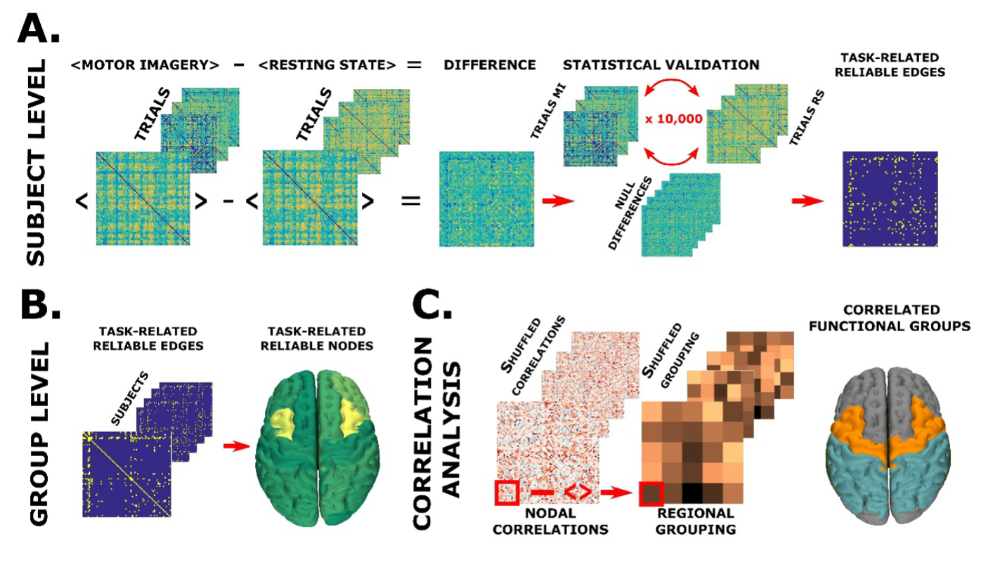

# NeuronalAvalanches4BCI

---
This repository contains the code and supporting documents associated with the following manuscript:

M.-C. Corsi*, P. Sorrentino*, D. Schwartz, N. George, L. Hugueville, A. E. Kahn, S. Dupont, D. S. Bassett, V. Jirsa, F. De Vico Fallani (2022). Measuring Neuronal Avalanches to inform Brain-Computer Interfaces. Biorxiv. https://www.biorxiv.org/content/10.1101/2022.06.14.495887v1

*These authors contributed equally to this work.
 
---
## Authors:
* [Marie-Constance Corsi](https://marieconstance-corsi.netlify.app), Sorbonne Université, Institut du Cerveau
* [Pierpaolo Sorrentino](https://scholar.google.nl/citations?user=T1k8qBsAAAAJ&hl=en), Institut de Neuroscience des Systèmes, Aix-Marseille University
* Denis Schwartz, CERMEP, Lyon
* Nathalie George, Sorbonne Université, Institut du Cerveau
* Leonardo Gollo, Monash University
* Sylvain Chevallier, LISN-CNRS, Université Paris-Saclay
* Laurent Hugueville, Sorbonne Université, Institut du Cerveau
* Ari E. Kahn, University of Pennsylvania, Philadelphia
* Sophie Dupont, Sorbonne Université, Institut du Cerveau
* Danielle S. Bassett, University of Pennsylvania, Philadelphia
* Viktor Jirsa, Institut de Neuroscience des Systèmes, Aix-Marseille University
* Fabrizio De Vico Fallani, Sorbonne Université, Institut du Cerveau

---
## Abstract
Large-scale interactions among multiple brain regions manifest as bursts of activations called neuronal avalanches, which reconfigure according to the task at hand and, hence, might constitute natural candidates to design brain-computer interfaces (BCI). To test this hypothesis, we used source-reconstructed magneto/electroencephalography, during resting state and a motor imagery task performed within a BCI protocol. To track the probability that an avalanche would spread across any two regions we built an avalanche transition matrix (ATM) and demonstrated that the edges whose transition probabilities significantly differed between conditions hinged selectively on premotor regions in all subjects. Furthermore, we showed that the topology of the ATMs allows task-decoding above the current gold standard. Hence, our results suggest that Neuronal Avalanches might capture interpretable differences between tasks that can be used to inform brain-computer interfaces.

## Code
This repository contains the code used to run the analysis performed and to plot the figures.
Analysis was performed with the following Matlab version: 9.10.0.1649659 (R2021a) Update 1.
For a complete list of the Matlab packages used for the analysis, please refer to the 'Start_SessionMatlab.m' file.
In 'requirements.txt' a list of all the Python dependencies is proposed to plot the connectomes.

---
## Figures

### Figure 1 - Overview of the analysis 

*A. Subject-level analysis. B. Group-level analysis. C. Correlation analysis.*

### Figure 2 - Reliability analysis

*A. Edge-wise differences in transition probability. B. Edge-wise differences in transition probability between hit/miss trials. C. Node-wise differences in transition probability. *

### Figure 3 - Classification analysis

*A & D. Group-level classification performance obtained from MEG and EEG data. B & E. Individual-level classification performance from MEG data and EEG data. C & F. Individual-level classification performance variability from MEG data and EEG data.*

### Figure 4 - Correlation analysis

*A. Edge-wise correlations. B. Node-wise differences in transition probabilities.*

